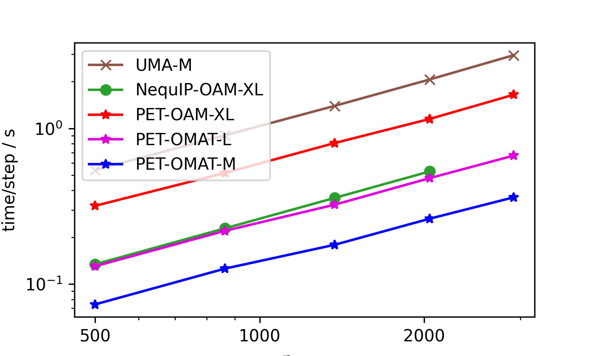
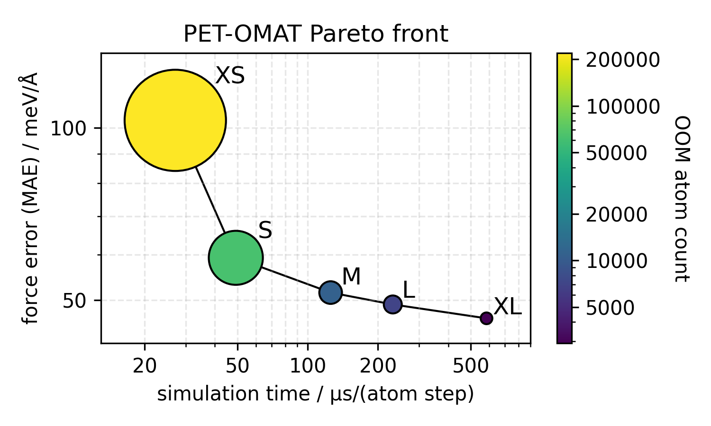
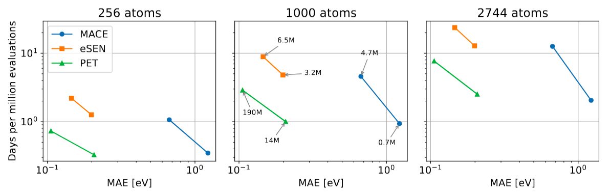

Seeing the parameter counts of our larger models, it would be
tempting to think that the models are slow. This is not the case, as we use our
parameters in a very sparse manner. Here we present a few benchmarks.

First, we present a benchmark of the top three open-source models on Matbench Discovery 
(as of Jan 14, 2026), replacing eSEN by its successor UMA-M. These were run on an H100 GPU (96GB VRAM). 
The structures are aluminum cells of increasing sizes and report time per energy/conservative force 
evaluation (lower is better). 
The NequIP model ran out of memory during the evaluation of the large structure (hence the missing
point on the right).

  

Besides the large PET-OAM-XL model, the figure also shows timings for two OMat24-trained models 
that are smaller (and faster). To get a sense of the speed-accuracy tradeoff, as well as the
memory requirements of the entire PET-OMAT family, we also show a Pareto plot comparing 
cost and OMat24 validation errors

  

Finally, we present a benchmark we ran on carbon structures using models trained on the
SPICE dataset. This benchmark was run on an A100 GPU (cf. 
[this preprint](https://arxiv.org/abs/2601.16195) for 
details on the models being compared).

  

