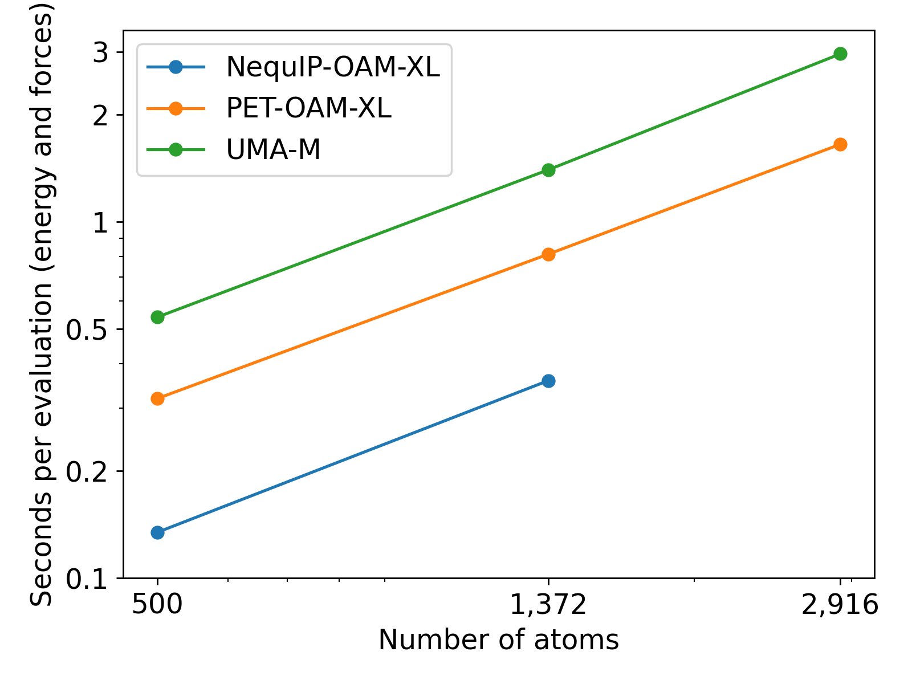

Seeing the parameter counts of our larger models, it would be
tempting to think that the models are slow. This is not the case, as we use our
parameters in a very sparse manner. Here we present a few benchmarks.

First, we present a benchmark of the top three open-source models on Matbench Discovery (as of Jan 14, 2026),
replacing eSEN by its successor UMA-M. These were run on an H100 GPU. The structures
are aluminum cells of increasing sizes. The NequIP
model ran out of memory during the evaluation of the large structure (hence the missing
point on the right).

  

Then, we present a benchmark we ran on carbon structures using models trained on the
SPICE dataset. This benchmark was run on an A100 GPU.

  

